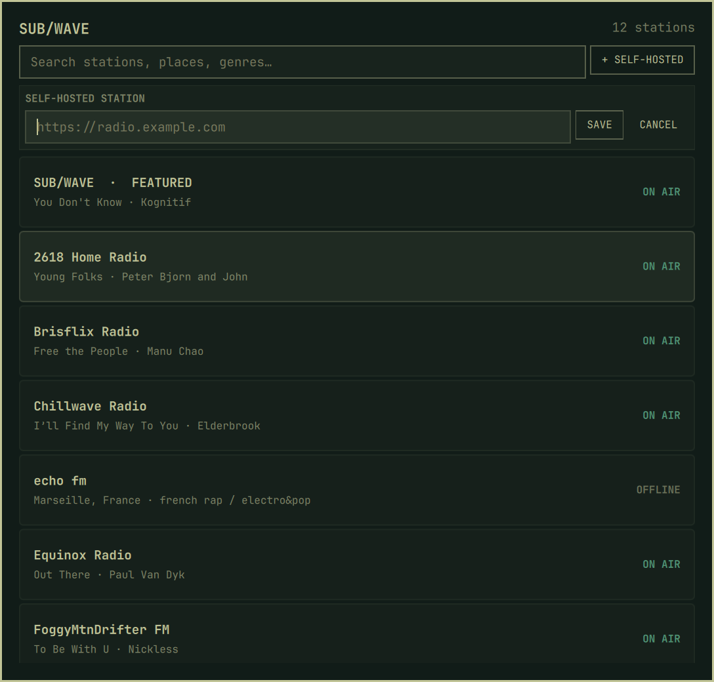

# SUB/WAVE for Omarchy

Listen to your own [SUB/WAVE](https://www.getsubwave.com) station and explore
the public community directory without leaving the Omarchy shell. The plugin
adds a theme-aware bar widget, a searchable station picker, and an MPV player
that works with Omarchy's existing media controls.



## Install

```bash
omarchy plugin add https://github.com/getsubwave/omarchy-subwave.git --enable
```

## Dependencies

The plugin requires Omarchy Quattro and these Arch packages:

```text
curl jq mpv mpv-mpris socat
```

They provide the public station fetcher, JSON validation, guarded audio player,
MPRIS integration, and local MPV control socket. The plugin does not install or
modify system packages itself.

The community directory works immediately. To put your own self-hosted station
first in the list, open the picker, choose **+ SELF-HOSTED**, and save its bare
public origin. You can configure the same setting from the terminal:

```bash
omarchy bar set getsubwave.radio stationUrl https://radio.example.com
```

Do not include `/listen`, `/stream.mp3`, credentials, query parameters, or a
fragment. The plugin derives the API and stream paths from the origin.

## Controls

### Bar

| Input | Action |
| --- | --- |
| Left click | Open or close the station picker |
| Middle click | Play or pause |
| Right click | Stop playback |
| Mouse wheel | Change volume in 5% steps |

### Station picker

| Input | Action |
| --- | --- |
| Type | Search names, places, genres, operators, and descriptions |
| Up / Down | Move through stations |
| Enter | Play the selected station |
| Escape | Clear search, then close |

Selecting the station that is already playing closes the picker. Playback uses
the station's always-available `/stream.mp3` mount. `mpv-mpris` exposes it to
the built-in `omarchy.media` widget, media keys, and compatible headset controls.

## Data and privacy

The plugin fetches the normalized community directory from
`https://www.getsubwave.com/stations.json`. It asks each visible station's
public `/api/now-playing` endpoint for its current track and online state, and
connects MPV directly to the selected station's `/stream.mp3` mount.

Remote responses are size- and record-limited before entering QML. Only
credential-free HTTP(S) origins are accepted, remote strings are never
evaluated as commands, and cache/status writes are atomic.

Version 1 supports public stations only. It does not accept or store listener
passwords. Favorites, requests, and station administration remain in the
station's web player.

Non-secret persistent data is stored in:

```text
${XDG_DATA_HOME:-~/.local/share}/omarchy-subwave/
```

Player sockets, status, PID identity, and logs live in:

```text
$XDG_RUNTIME_DIR/omarchy-subwave/
```

## Remove

Stop the dedicated player before removing the plugin:

```bash
~/.config/omarchy/plugins/getsubwave.radio/subwave-player stop
omarchy plugin remove getsubwave.radio
```

The last station, volume, and directory cache remain under
`~/.local/share/omarchy-subwave/`. Remove that directory manually only if you
also want to delete those preferences.

## Troubleshooting

Check the helper contracts directly:

```bash
~/.config/omarchy/plugins/getsubwave.radio/subwave-fetch catalog | jq 'length'
~/.config/omarchy/plugins/getsubwave.radio/subwave-fetch now-playing https://radio.example.com | jq .
~/.config/omarchy/plugins/getsubwave.radio/subwave-player status | jq .
```

MPV diagnostics are written to
`$XDG_RUNTIME_DIR/omarchy-subwave/mpv.log`. If the bar does not pick up a saved
plugin change, run:

```bash
omarchy-shell shell rescanPlugins
```

Malformed or oversized saved data is not overwritten automatically. Back up
the affected file under `~/.local/share/omarchy-subwave/` before repairing or
removing it.

## Development

```bash
./tests/run
omarchy plugin validate .
qmllint -I /usr/share/omarchy/shell BarWidget.qml StationPicker.qml
```

The test suite uses temporary XDG directories and fake network/player
boundaries; it does not tune a real station. The final QML checks require an
Omarchy installation because they import the installed shell components.

## License

MIT
